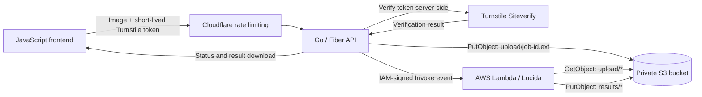

# Void Remover

Void Remover is a serverless background-removal application built with Go,
AWS Lambda, and the
[Lucida](https://github.com/egeorcun/lucida) image-matting model. Users upload
an image without creating an account and receive a transparent PNG.

## Architecture

Amazon ECR stores the Lambda container image; it does not receive user uploads
or trigger the function.

## Request Flow

1. Cloudflare applies an edge rate limit before a request reaches the Go API.
2. The frontend submits the image and a short-lived Turnstile token.
3. Go verifies the token with Cloudflare's Siteverify API. The browser is never
   trusted to verify its own token.
4. Go validates the file size, decoded dimensions, format, and extension. Only
   JPEG and PNG images up to 4 MB and 25 million pixels are accepted.
5. Go assigns the request a UUID and uploads the cleaned image to the private
   S3 `upload/` prefix.
6. Go invokes Lambda through the AWS SDK. The request is authenticated with the
   backend's IAM identity; no Lambda URL or AWS credential is exposed to the
   browser.
7. Lambda reads the input object, runs Lucida, and writes a transparent PNG to
   the S3 `results/` prefix.
8. Go returns the processing status and makes the completed result available
   to the frontend for download.

Objects under `upload/` and `results/` are temporary and are removed by an S3
lifecycle rule after one day.

## Security Boundaries

- Cloudflare rate limiting reduces automated request floods at the edge.
- Turnstile is verified by Go before an upload is accepted.
- The frontend receives no AWS access keys or direct Lambda access.
- The Go runtime identity is limited to uploading inputs, reading results, and
  invoking the image-processing function.
- The Lambda execution role can only read `upload/*`, write `results/*`, and
  publish logs.
- S3 remains private, and temporary objects expire automatically.

## Tech Stack

- Go and Fiber
- JavaScript frontend
- Cloudflare and Turnstile
- Amazon S3
- AWS Lambda with Python 3.12 on ARM64
- Amazon ECR and Docker
- Lucida

## Implementation Status

- [x] Go upload validation and temporary-file handling
- [x] Lambda-compatible Lucida container
- [x] ARM64 ECR build and deployment workflow
- [x] Least-privilege Lambda access to the S3 input and result prefixes
- [ ] Cloudflare Turnstile verification in Go
- [ ] Go upload to S3 and IAM-authenticated Lambda invocation
- [ ] Processing-status and result-download endpoints
- [ ] JavaScript upload and result interface

Lambda-specific build, event, IAM, and cost notes are documented in
[`lambda/lucida/README.md`](lambda/lucida/README.md).

## Project Purpose

This project demonstrates a security-conscious boundary between a public web
application, a Go orchestration API, private object storage, and serverless
machine-learning inference.
